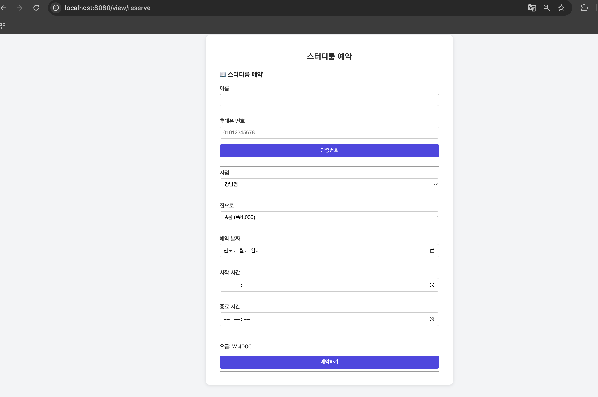
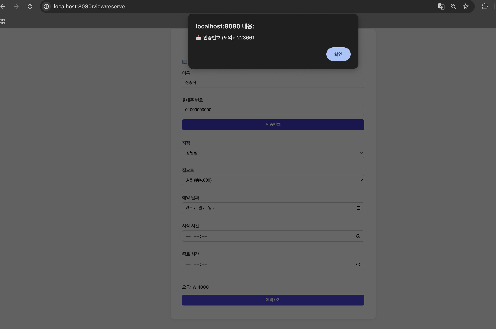
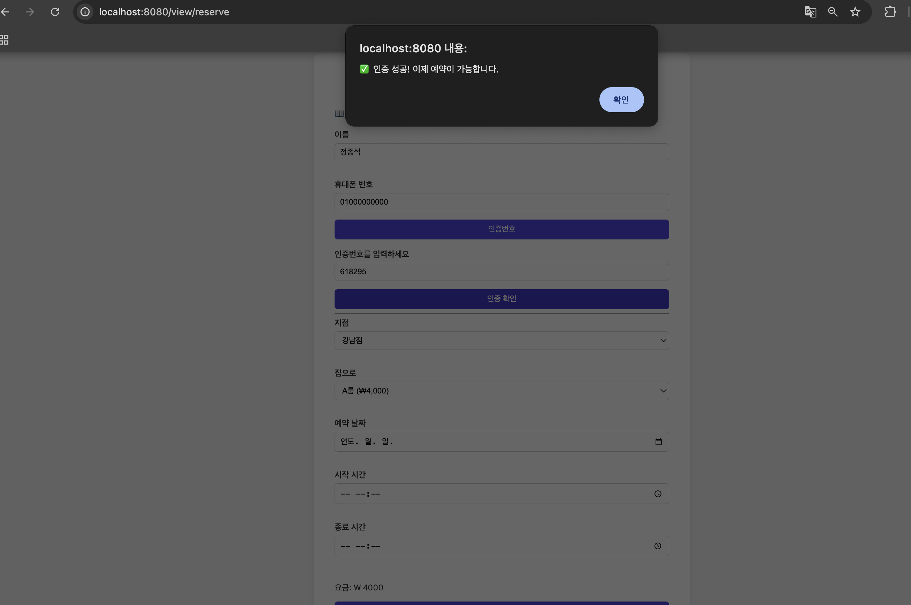
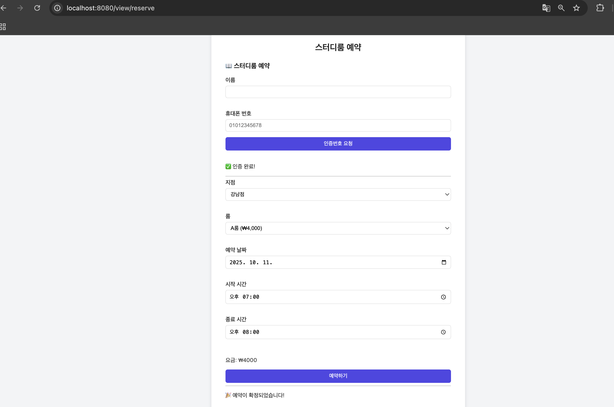
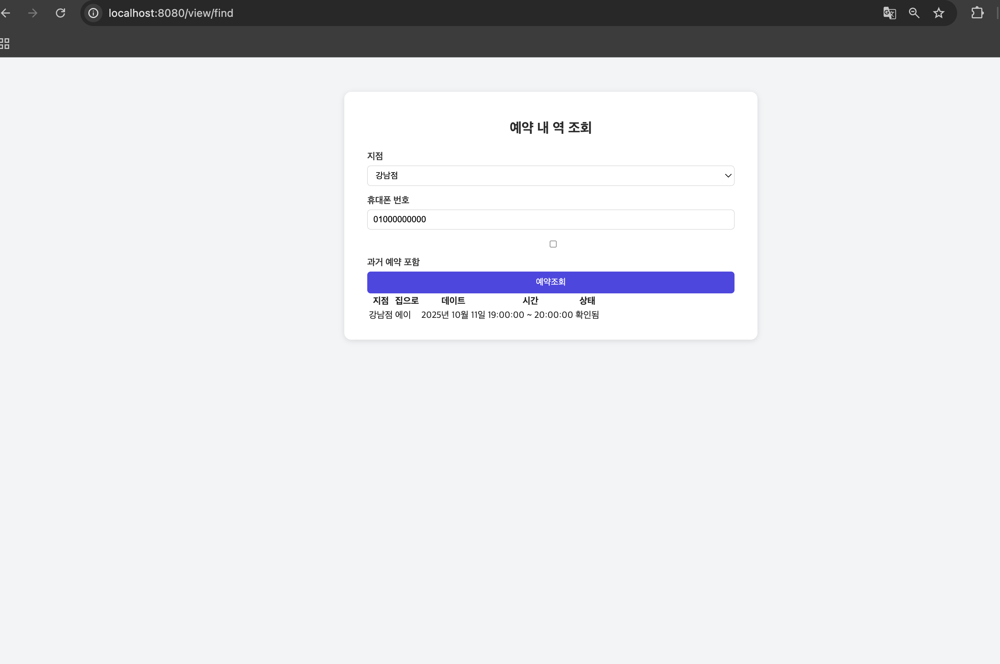
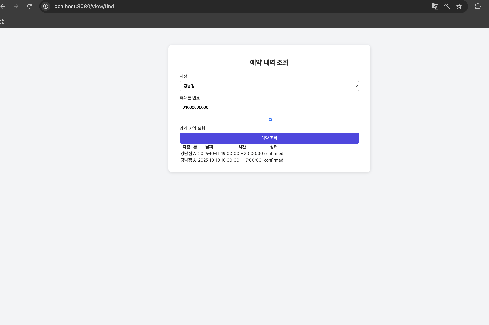
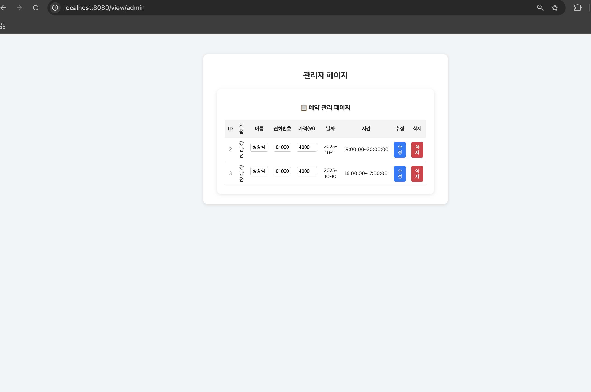
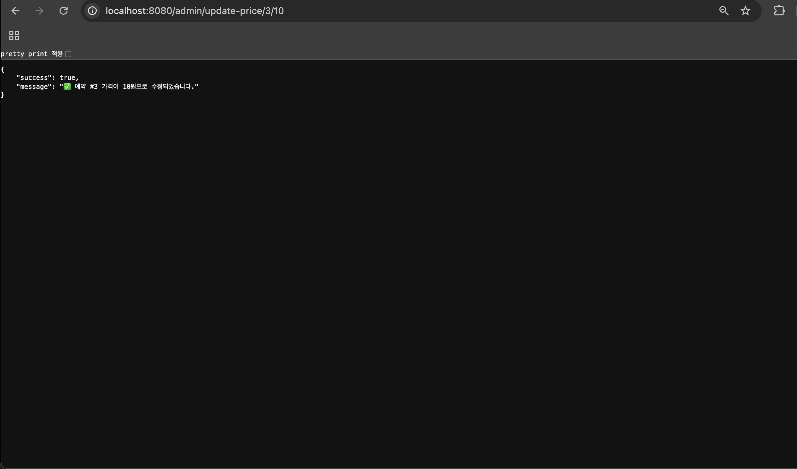
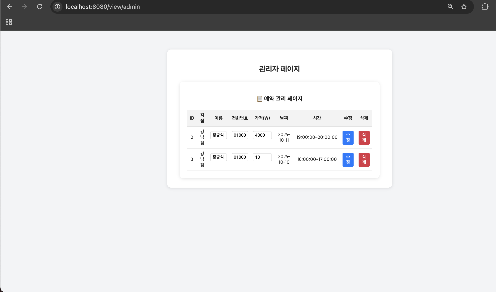

# 📚 스터디룸 예약 시스템 (CodeIgniter4)

스터디룸 예약 및 관리 시스템입니다.  
사용자는 웹에서 예약 및 인증을 진행할 수 있고, 관리자는 별도의 페이지에서 요금 및 회원정보를 수정하거나 예약을 삭제할 수 있습니다.

---

## 구현 화면
예약화면


휴대폰 인증



예약 완료


예약 조회(과겨내역 미포함)

예약 조회(과거내역 포함)


관리자 페이지


restapi를 이용한 수정


수정된 데이터



## 🧱 기술 스택

- **언어**: PHP 7.4
- **프레임워크**: CodeIgniter 4.x
- **DB**: MySQL 8 / MariaDB 10.6+
- **패키지 매니저**: Composer 2.x
- **타임존**: Asia/Seoul
- **로컬 서버**: `php spark serve`

---

## ⚙️ 설치 및 실행

### 1️⃣ 프로젝트 클론 및 의존성 설치
```bash
git clone https://github.com/yourname/studyroom-ci4.git
cd studyroom-ci4
composer install
2️⃣ .env 설정
.env 파일이 없으면 루트에 새로 생성하고 아래 내용을 참고하세요 👇


CI_ENVIRONMENT = development

app.baseURL = 'http://localhost:8080'
app.appTimezone = Asia/Seoul
app.defaultLocale = ko

database.default.hostname = 127.0.0.1
database.default.database = studyroom
database.default.username = root
database.default.password = 12345
database.default.DBDriver = MySQLi
database.default.port = 3306


🚀 로컬 서버 실행

php spark serve
실행 후 브라우저에서 아래 주소로 접근하세요 👇

구분	URL
예약 페이지	http://localhost:8080/view/reserve
예약 조회	http://localhost:8080/view/find
관리자 페이지	http://localhost:8080/view/admin

🔧 관리자 기능 (REST API)
기능	URL 예시
가격 수정	/admin/update-price/{예약ID}/{새가격}
회원 정보 수정	/admin/update-member/{회원ID}/{이름}/{전화번호}
예약 삭제	/admin/delete/{예약ID}

예시 👇


http://localhost:8080/admin/update-price/3/9000
http://localhost:8080/admin/update-member/2/홍길동/01099998888
http://localhost:8080/admin/delete/5


⚙️ 파일별 역할 요약
🧠 Model (ReservationModel.php)

DB와 직접 통신하는 계층

예약/회원 데이터의 CRUD 처리

주요 기능:

generateCode() : 6자리 인증번호 생성

hasOverlap() : 중복 예약 확인

upsertMember() : 회원정보 등록/갱신

adminUpdateMember(), adminUpdatePrice() : 관리자 수정 기능

🧭 Controller (ReservationController.php)

View로부터 받은 요청을 처리하고 Model을 통해 DB 작업 수행

세션 관리 및 JSON 응답 반환

주요 메서드:

requestCode() : 인증번호 발급 (모의 SMS)

verifyCode() : 인증번호 검증

create() : 예약 생성

findReservations() : 예약 조회

adminUpdateMemberGet() / adminUpdatePriceGet() : 관리자 수정 기능

🗺 Routes (Config/Routes.php)

URL → Controller 메서드 연결 설정

예시:

$routes->post('/api/reservations/create', 'ReservationController::create');
$routes->get('/api/reservations/find', 'ReservationController::findReservations');

💻 View (reservation_view.php 등)

사용자 인터페이스(UI)

HTML + JavaScript (Axios 사용)

예약 입력, 인증 요청/확인, 결과 출력

주요 요청 흐름:

requestCode() → 인증번호 요청

verifyCode() → 인증번호 확인

createReservation() → 예약 확정

🔄 동작 흐름 요약
[View] → [Routes] → [Controller] → [Model] → [Database]
   ↑                                        ↓
   └────────────── JSON 응답 (성공/실패 메시지)


예시:

사용자 입력 → /api/reservations/request-code

컨트롤러가 인증번호 생성 후 세션 저장

인증 완료 후 /api/reservations/create 로 예약 확정

결과 JSON 응답 출력 (🎉 예약 완료 메시지)

🧠 주요 핵심 함수 (비즈니스 로직 중심)
함수명	위치	역할
requestCode()	Controller	이름/전화번호를 받아 6자리 인증번호 생성 후 세션 저장
verifyCode()	Controller	사용자가 입력한 인증번호 검증 (세션과 비교)
create()	Controller	인증된 사용자의 예약정보를 DB에 저장
hasOverlap()	Model	같은 지점/룸/날짜/시간에 겹치는 예약이 있는지 확인
upsertMember()	Model	회원이 이미 있으면 업데이트, 없으면 새로 등록
generateCode()	Model	6자리 무작위 숫자 인증코드 생성
adminUpdateMemberGet() / adminUpdatePriceGet()	Controller	관리자    페이지에서 회원정보나 가격 수정
findReservations()	Controller	특정 전화번호의 예약내역 목록 조회